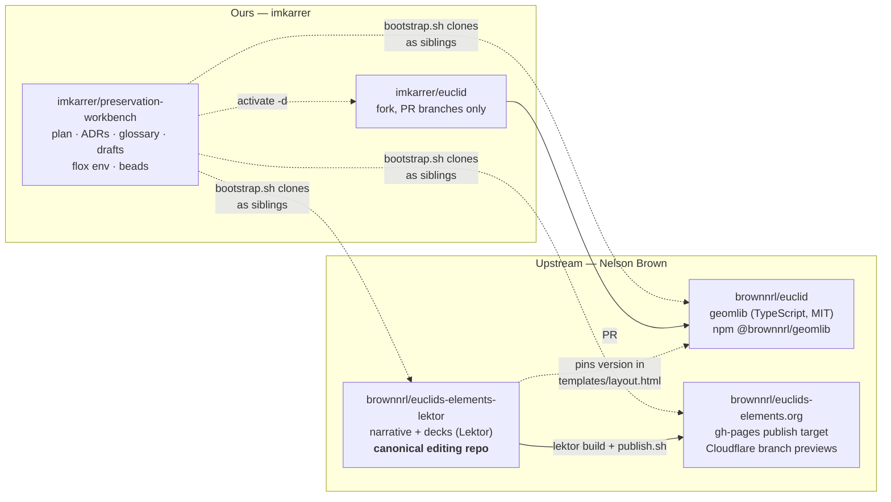
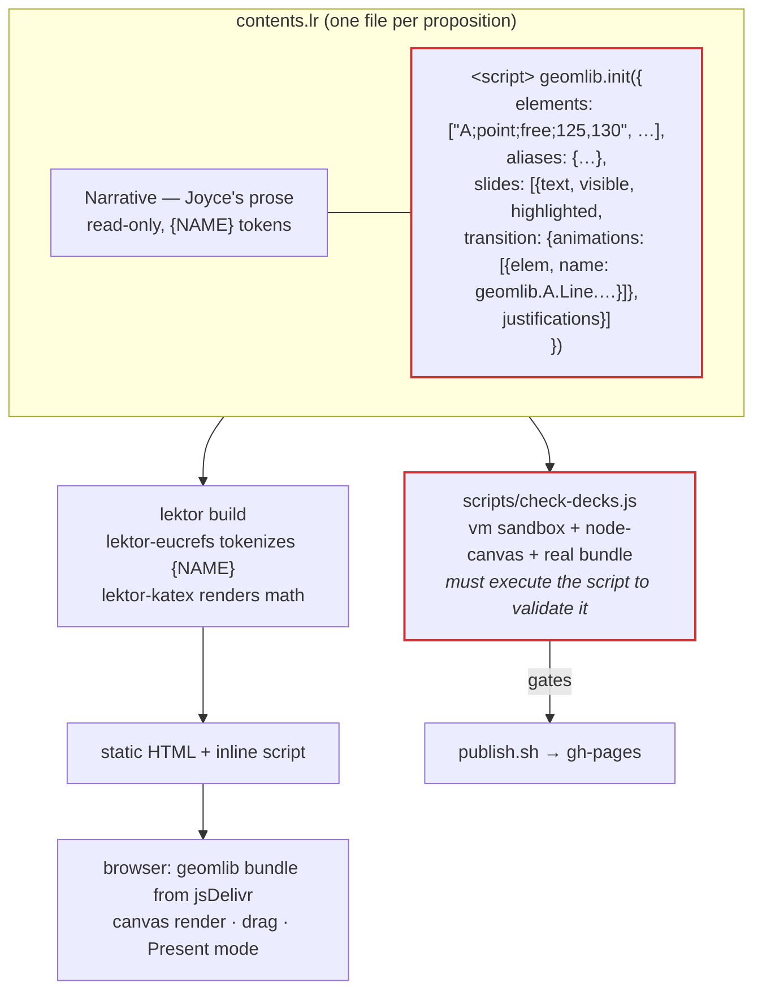
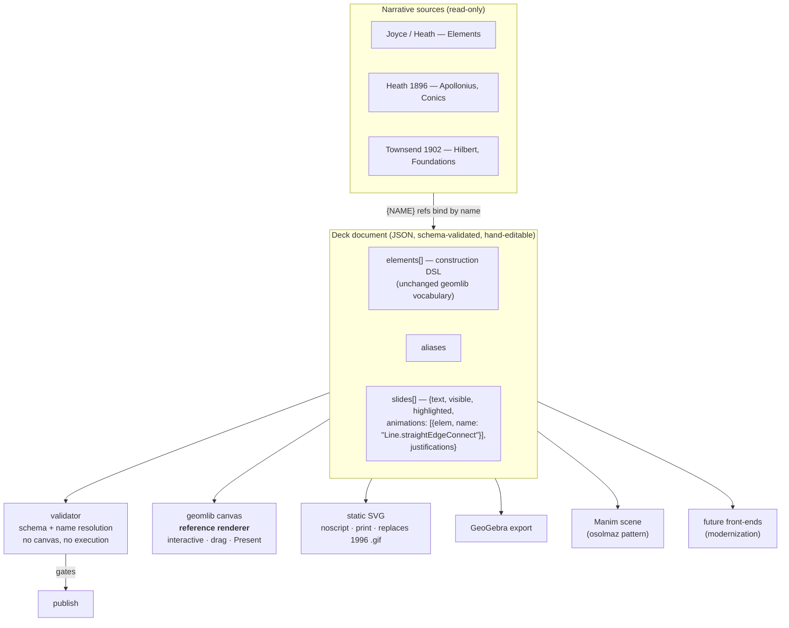
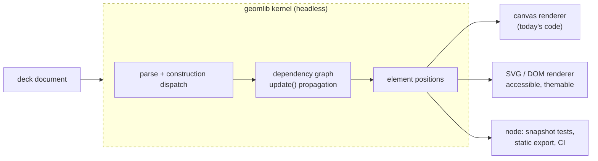
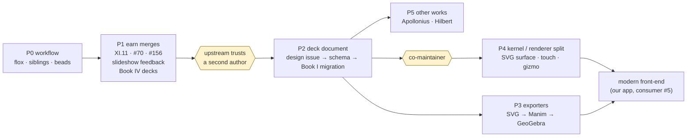

# Architecture

_Draft, 2026-09-20. Diagrams are Mermaid; GitHub renders them. "As is" is
verified against upstream code; "proposed" is ADR 0002 and is not agreed
with upstream yet._

## Repositories and who owns what

## As is: a proposition page today

The red boxes are the seam. The deck is JavaScript embedded in markdown,
so it can only be validated by execution, only consumed by geomlib, and every
library rename (see upstream's #91 angle-marker rework column in the deck
tracker) is a deck re-authoring pass.

## Proposed: the deck is data (ADR 0002)

Introduced additively: `init()` already takes an object; the deltas are string
animation names beside the enums, a construction-name lookup, a validator entry
point, and a Lektor field that stores the document and emits the script at
build time. Legacy inline-script pages keep working.

## Proposed, later: kernel and renderers (Phase 4)

Today elements draw themselves with a canvas context, so this split is a real
refactor of upstream code and waits until trust is established. It is what
unlocks the accessible surface, touch (#57), the affine/rotation gizmo, and an
explicit-transform fix for the XI.11 class of bug.

## Roadmap as a dependency graph

Every phase is independently acceptable or rejectable by upstream. P1 and P3
have value even if P2 and P4 never happen. The yellow gates are human
decisions, not milestones we control.

## Open questions the research notes must answer

Tracked in `docs/research/`:

- **geomlib internals** — is "additive" honest? What in `init()` is not
  JSON-serializable today? Can the kernel run headless?
- **Lektor pipeline** — does upstream's planned "structured-field refactor of
  proposition.model" already amount to a deck document? If so, ADR 0002 is
  help with his refactor, not a new proposal.
- **Interchange formats** — what should the document borrow from Intergeo,
  GeoGebra XML/commands, canberead, osolmaz's Manim JSON?
- **Source texts** — which editions are public domain in the US, and what does
  Joyce's permission actually cover?
