# Delivery pipeline: the corpus as a build

Nelson Brown delivers one deck at a time with a person watching every slide.
That produced 62 decks in three months and a process document already
shaped like a pipeline. 403 decks remain, 75 of them in the solid books
where the library has never been exercised by a deck. This document plans
a framework in which every unit of a corpus moves through the same states,
every transition is a gate made of named checks, every check leaves
evidence, and a loop (bead-loop) works the corpus slowly and predictably
while a human only approves and merges. Euclid's *Elements* is the first
binding of the framework; the abstract parts are written so Apollonius and
Hilbert are a second binding, not a second pipeline.

It extends [PLAN.md](../../PLAN.md) §4 and [ADR 0002](../adr/0002-deck-as-data-not-a-new-kernel.md);
it does not replace them. Vocabulary is [CONTEXT.md](../../CONTEXT.md).

## 1. What Brown built, read as a pipeline

Every stage below exists upstream today, once, by hand. Paths are relative
to the sibling checkouts (`lektor/`, `euclid/`).

| Stage | Artifact | Tool | Gate? | Where it runs |
|---|---|---|---|---|
| Plan | planning table (markdown, seven columns) | `lektor/doc/process.md` §"The planning table" | human: "review it with the author **before implementing**" | issue or PR comment |
| Implement | `geomlib.init({...})` literal inside the `proof` field | hand or agent, per `process.md` | — | `contents.lr` |
| Verify | checklist: `node --check`, `lektor build`, walk every slide, hover every ref, drag | manual | — | author's machine |
| Deck check | diagnostics from the real bundle | `lektor/scripts/check-decks.js` (vm sandbox + node-canvas) | blocks publish and preview | author's machine; **no CI on the lektor repo** (no `.github/`) |
| Caption fidelity | in-order word run of the proof, threshold 0.92 | `lektor/scripts/check-captions.py` | advisory, run by hand per book | author's machine |
| Pin drift | every hardcoded geomlib version equals the layout's | `lektor/scripts/check-versions.js` | blocks publish | author's machine |
| Subject index | JSON databag + validator | `lektor/scripts/check-subjindex.py` | blocks publish | author's machine |
| Track | row + summary per deck | `lektor/doc/deck-tracker.md` | — | hand-edited |
| Deliver | one PR per book (#15 Book I, #35 Book II), one "reviewed" commit per proposition | Nelson | his review | GitHub |
| Preview | `lektor build` force-pushed to `lektor/<branch>` on his site repo | `lektor/scripts/deploy-preview.sh` → Cloudflare Workers | — | his credentials |
| Publish | checks → build → interactive confirm → `lektor deploy` → `gh-pages` | `lektor/scripts/publish.sh` | the three checks above | his laptop |
| Library | typecheck + unit tests on PR; 705 snapshot tests **local only** (goldens are gitignored); npm publish; one pin in `lektor/templates/layout.html` | `euclid/.github/workflows/test.yml`, `npm test` | CI on the library only | GitHub Actions |

Two data-first precedents are his own: the `/geomlib/` reference pages are
generated from Python tuples with string animation names
(`lektor/scripts/gen-reference/`), and the subject index moved from a
1500-line HTML body to JSON plus a publish-gating validator (lektor#3) once
a second consumer appeared. His rules for what a check may never do are
also explicit: a diagnostic is never silenced by deleting a name, and a
library need becomes a euclid issue, never an undocumented deck-side hack.

## 2. What is missing for a corpus run

1. **No document.** A deck exists only as JavaScript that must be executed
   to be read; its plan exists only as a markdown table. Nothing links the
   two, so nothing can check that what shipped is what was approved.
2. **No CI on the content.** `check-decks.js` runs on the publisher's
   laptop. A PR to the lektor repo is checked by nobody until publish time.
3. **Execution is the only validator, and it stops at the first error.**
   `init()` throws on the first bad element (one `init-failed` per deck,
   naming neither of two typos); caption `{NAME}` typos are silent; nothing
   checks that the narrative was left alone, which is the one rule that can
   never be broken.
4. **Nothing looks at the rendered slides except a person.** The 0.16 pin
   bump surfaced 70 diagnostics on 21 untouched pages, at pin time, because
   nothing renders the corpus against a candidate bundle before the bump.
5. **Tracking is prose.** `deck-tracker.md` is a hand-kept table with
   post-mortems in the cells; it cannot be queried for "what blocks Book X".
6. **Three units, no mapping.** The unit of work is a proposition, the unit
   of delivery is a book, the unit of review is a slide. Nothing carries a
   proposition's state from plan to PR to publish.
7. **The solid books need library work no deck has exercised.** See §7.

## 3. The abstract framework

### 3.1 Concepts and the Euclid binding

| Concept | Definition | Euclid binding |
|---|---|---|
| **Work** | one classical text being preserved | the *Elements*, Joyce's edition |
| **Corpus** | the set of units of a work, in the order the maintainer wants them delivered | 465 proposition pages; order = lektor #21–#31 (Book III first) |
| **Unit** | the thing one bead delivers and one human approves | one proposition's deck on one canvas |
| **Narrative** | read-only source prose the unit walks | `proof` and `guide` fields of `contents.lr` |
| **Figure** | the constructed diagram the unit animates | the `elements` of one `geomlib.init` |
| **Document** | the unit as data, the single source for plan, implementation and evidence | `works/euclid-elements/decks/<book>/<prop>.deck.json` |
| **Oracle** | something a check compares against that is not the document itself | the narrative; the figure; geomlib run from source; goldens; the approved plan; a browser; Nelson |
| **Check** | a deterministic function from (document, oracles, pinned versions) to a verdict, findings and evidence | §5.3 |
| **Gate** | a named set of checks with a blocking policy, attached to one state transition | §5.4 |
| **Evidence** | what a check leaves behind so the verdict can be trusted without re-running it, and re-run when it must be | §5.6 |
| **Target** | the git checkout a bead works in and the repo its PR goes to (bead-loop's word) | `workbench` (this repo), `lektor`, `euclid` |
| **Human gate** | a transition only a person may make, with a defined artifact and a defined question | Nelson approves a table; Nelson merges; Nelson publishes |

### 3.2 The document lifecycle is the state machine

A document is always in exactly one state. Every transition is a gate; a
gate is checks plus, for two of them, a person.

```mermaid
stateDiagram-v2
    [*] --> drafted: planning worker writes the document
    drafted --> planned: G1 plan gate (machine)
    planned --> approved: H1 Nelson approves the generated table
    approved --> implemented: G2 implement gate (machine)
    implemented --> verified: G3 render gate (machine)
    verified --> delivered: G4 deliver gate (machine) then PR
    delivered --> published: H2 Nelson merges and publishes; G5 publish checks
    published --> implemented: pin moved, evidence stale (re-verify)
    planned --> drafted: table rejected, note on the bead
    implemented --> approved: render gate failed, note on the bead
```



The state lives in the document (`state`), with the evidence that
justifies it (`evidence[]`, §5.6). The corpus ledger (§5.7) is nothing but
the documents read together.

### 3.3 Two beads per unit

A bead-loop round works one target. The document lives in this repo and
the generated page lives in the lektor checkout, and between them stands
Nelson's approval. So one unit is two beads:

| Bead | Target | Worker's job | Gate | Ends when |
|---|---|---|---|---|
| **plan** `<prop> plan` | `workbench` (default target) | write the document from figure + narrative, run the plan checks, commit | G1 | merged to this repo's `main` by the loop's reviewer; the table is posted where Nelson reads it |
| **implement** `<prop> implement` | `lektor` (pw-j4m) | run the generator, resolve what it cannot (a colliding figure addition, a missing target), run the render checks, commit | G2 + G3 | `open_pr = ask`: the branch is pushed, the operator opens or updates the book PR |

The implement bead depends on the plan bead and on the document reaching
`approved`. Approval is recorded by a person (a `review` object with the
URL of Nelson's comment, committed to this repo); the implement bead's gate
refuses a document that is not `approved`, so the loop cannot run ahead of
him. Library gaps found while planning (`not_yet_implemented`) file a third
kind of bead on the `euclid` target and block the implement bead, which is
`process.md` step 6 made mechanical.

### 3.4 The document, v0

Derived from what `ISlide` reads — five fields and nothing else
(`euclid/src/index.ts:222-228`) — plus what `process.md` asks the table to
say, plus lifecycle and evidence:

```json
{
  "schema": "deck/0",
  "work": "euclid-elements", "prop": "IV.1", "canvas": "canvas_0",
  "state": "drafted",
  "figure_additions": ["CEseg;line;connect;C,E;0;0;0"],
  "aliases": { "EAF": "AEF", "CE": "CEseg", "CA": "AC" },
  "deferDraggables": [],
  "slides": [
    { "text": "Draw a diameter {BC} of the circle {ABC}.",
      "sentence": 3,
      "visible": ["ABC", "D", "D1", "D2", "B", "C", "BC", "O"],
      "highlighted": ["BC"],
      "transition": { "animations": [ { "elem": "BC", "name": "Line.straightEdgeConnect" } ] },
      "justifications": [ { "claim": "diameter through the centre", "ref": "III.1" } ] }
  ],
  "not_yet_implemented": [],
  "review": null,
  "evidence": []
}
```

`sentence` is the index into `narrative.json` of the sentence the caption
carries; it is what makes caption fidelity and justification consistency
checkable rather than guessed. `visible` is absolute, as geomlib reads it;
the table renderer computes the `+X / −X / (inherit)` deltas that
`process.md` wants. `resolveJustification` and `window.eucrefs` are not in
the document; the generator emits them from the `ref` list, because
lektor-eucrefs already knows every URL. Nothing in the document is a
function, an enum, a comment, or a `random` colour.

Location: this repo until upstream takes a sidecar (the `[!figure
canvas_0]` directive from `docs/research/lektor-content-pipeline.md`). The
sixteen Book IV tables in `works/euclid-elements/book-iv/` are the first
conversion; after it the markdown there is output, not source.

## 4. Stages

```mermaid
flowchart LR
    LR[contents.lr<br/>narrative + figure] --> X[Extract]
    X --> FIG[figure.json]
    X --> NAR[narrative.json<br/>sentences, just tags, canvas order]
    FIG --> P[Plan bead<br/>target: workbench]
    NAR --> P
    P --> DOC[document<br/>drafted]
    DOC --> G1{G1 plan gate}
    G1 -->|green| TBL[generated table]
    TBL --> H1{{H1 Nelson approves}}
    H1 --> I[Implement bead<br/>target: lektor]
    I --> G2{G2 implement gate<br/>narrative-diff, round trip,<br/>check-decks, resting figure}
    G2 --> G3{G3 render gate<br/>per-slide state, diagnostics,<br/>goldens, contact sheet}
    G3 -->|green| BR[book branch]
    BR --> G4{G4 deliver gate<br/>build, versions, e2e sample}
    G4 --> PR[PR on brownnrl/euclids-elements-lektor]
    PR --> H2{{H2 Nelson merges, publishes}}
    H2 --> G5{G5 publish checks<br/>live smoke, ledger}
    CAND[geomlib candidate] -.-> CV[corpus visual run]
    CV -.->|impact report| H2
    style H1 fill:#fff3cd,stroke:#856404
    style H2 fill:#fff3cd,stroke:#856404
```



| Stage | Input | Output | Who |
|---|---|---|---|
| Extract | `contents.lr` | `figure.json` (elements in order, aliases, canvas ids), `narrative.json` (sentences with their `[!just]` refs and paragraph, canvas positions) | pipeline, deterministic |
| Plan | figure + narrative | document, `drafted`; on G1 green, the generated table | plan bead's worker |
| Approve | table | `review` recorded, state `approved` | Nelson, then the operator commits |
| Generate | approved document | `contents.lr` edit on the book branch | implement bead's worker running the generator |
| Render | built page + `euclid/` source | one PNG per slide, contact sheet, diagnostics JSON | pipeline |
| Deliver | book branch | PR with table and contact sheet linked, `How to verify` from the acceptance criteria | loop pushes; operator opens the PR (`open_pr = ask`) |
| Publish | his | live site | Nelson; G5 runs afterwards on our side |

## 5. Validation

### 5.1 Principles

1. **A rule is a check or it is not a rule.** Every authoring rule in
   `process.md` that can be mechanised is a check in §5.3; the rest are
   the human gate's questions in §5.5. New "caught on I.xx" lessons become
   checks with the incident as their seeded-fault fixture.
2. **Checks are deterministic functions.** Same document, same oracles,
   same pinned versions (geomlib commit, flox `manifest.lock`), same
   verdict and same evidence bytes. Anything that is not (timestamps,
   `random` colours, process-global font) is removed at the source.
3. **Evidence is a claim; the gate is the proof.** A worker runs the checks
   and writes evidence into the document; the gate re-runs them and refuses
   evidence it cannot reproduce. Nothing is trusted because it was written.
4. **Blocking by default, advisory by exception, and exceptions ratchet.**
   A check starts advisory only while the corpus it applies to is not yet
   clean; once clean, it blocks. `check-captions.py` upstream is the model:
   advisory today, blocking here from the first Book IV deck.
5. **A finding names a location and a fix.** Every finding has a stable
   code, the slide or element it points at, and the one-line action, so a
   worker's fix round (bead-loop gives one) can act on it without reading
   the check's source.
6. **Never silence by deletion.** His rule, kept: a finding is resolved by
   fixing the document or filing an issue and listing it under
   `known_failures` with the URL and an expiry (§5.9).
7. **The narrative is an oracle, never an input.** No check writes to it;
   two checks read it to prove nothing else did.

### 5.2 Oracles

| Oracle | What it is | Checks that use it |
|---|---|---|
| Schema | JSON Schema `deck/0` | P1 |
| Figure | `figure.json` extracted from the page; the construction registry from `euclid/src` (which constructions make draggable points) | P2, P7, P9, G7 |
| Narrative | `narrative.json`; the page's prose before the edit | P3, P4, G1 |
| Citation resolver | lektor-eucrefs' token grammar and URL rules | P5 |
| Animation registry | the 14 registered names, their element types, their `args` and `declaredNames`, read from `euclid/src` at the pin | P6 |
| Reference implementation | geomlib run headless from the `euclid/` source checkout at the pinned commit (`Slate.inTest`, `computeSlideState`) | P7 (cross-check), G4, G5, R1, R2 |
| Goldens | per-slide PNGs recorded under a named (geomlib commit, flox lock) pair | R3, G7, U1 |
| The approved plan | the document at the commit Nelson approved | G3 |
| DOM-order rule | `elem-ref-highlight.js`'s binding rule, re-implemented | G6 |
| Browser | Playwright against `lektor build` output | D4 |
| Live site | `www.euclids-elements.org` after publish | U2 |
| Nelson | H1, H2 | — |

### 5.3 Check catalogue

Levels: **P** plan (document only), **G** generate (document + page),
**R** render (headless geomlib), **D** deliver (build + browser), **U**
publish and corpus. Cost is per unit unless stated. "Prevents" cites the
upstream incident the check would have caught where one exists.

| Id | Check | Oracle | Prevents | Cost | Runs at |
|---|---|---|---|---|---|
| P1 | schema: shape, required fields, no functions, no enum values, no `random` | schema | malformed literal; euclid#84 flaky goldens | ms | L0–L2 |
| P2 | every name in `visible`, `highlighted`, `elem` and every `{NAME}` token resolves in figure ∪ `figure_additions`, one alias hop, plus names an animation declares it will create | figure, registry | `unknown-slide-name`; the euclid#159 keepCircles false positive (handled the way 0.15 handles it) | ms | L0–L2 |
| P3 | caption fidelity: the caption is an in-order word run of sentence `slides[i].sentence`, threshold 0.92 on the named sentence (not the whole proof) | narrative | II.4 slide 3 paraphrase | ms | L0–L2 |
| P4 | caption order and justification consistency: `sentence` indices non-decreasing unless a slide is marked `revisit`; each slide's `ref`s ⊆ the `[!just]` refs on that sentence's paragraph, or the slide says `cites_elsewhere` | narrative | a citation attached to the wrong step; a walk that jumps the proof | ms | L0–L2 |
| P5 | every `ref` parses and resolves under the eucrefs grammar (`I.5`, `I.Def.10`, `I.Post.3`, `C.N.1`, `X.Def.II.3`, `I.15.Cor`) | resolver | a chip linking to `#unresolved-…` | ms | L0–L2 |
| P6 | animation name is registered as a string, its element type matches `elem`'s type, `args` are in that animation's accepted set with the right shapes | registry | `unknown-animation`, `animation-type-mismatch`, `bad-animation-args` | ms | L0–L2 |
| P7 | effective visible set per slide, computed like `computeSlideState` (inheritance, highlighted auto-union, draggable auto-union minus `deferDraggables`): non-empty on every slide; every animated `elem` is in its slide's set; a name dropped then re-added is flagged | figure | a slide that shows nothing; an animation on a hidden element | ms | L0–L2 |
| P8 | `not_yet_implemented` is empty, or each entry names an open brownnrl/euclid issue and the document state may not pass `approved` | GitHub | a deck promised on a library feature nobody filed | s | L1–L2 |
| P9 | figure additions are additive: existing element strings unchanged and in order; additions are zero-colour targets, aliases or markers; nothing renames | figure | a changed resting figure (his rule: only `initiallyHidden` for anything added) | ms | L0–L2 |
| P10 | `evidence[]` entries are reproducible: re-running the check yields the same verdict and report hash | all above | trusted-but-wrong evidence | ms | L1–L2 |
| G1 | narrative-diff: prose outside `<figure>` with `{NAME}`, `{DISPLAY\|NAME}`, `{NAME:canvas_N}` tokens replaced by their display text equals the prose before the edit, whitespace-normalised, `[!just]` kept | narrative | any edit to Joyce's words | ms | L1–L3 |
| G2 | generator idempotence: regenerate from the document, the diff is empty | document | hand edits to the generated literal that the document does not carry | s | L1–L2 |
| G3 | plan-versus-shipped round trip: the slides literal extracted from the page parses as JSON and equals the approved document's `slides`, `aliases`, `deferDraggables` at the approved commit | approved plan | shipping something other than what was reviewed | ms | L1–L3 |
| G4 | `lektor/scripts/check-decks.js` at the current pin, zero issues on the changed pages | reference impl (bundle) | everything #154 catches | s per page | L1–L3 |
| G5 | per-element construction diagnostics from source: every element of the page's figure constructs, each failure reported by name (mirrors `SnapshotHelper.ts:63-76`) | reference impl (source) | one `init-failed` hiding the second typo | s | L1–L2 |
| G6 | ref binding: for every `span.elem-ref` in the built page, the DOM-order rule binds it to the canvas the document names (`canvas` default or explicit `:canvas_N`), and the name exists there | DOM-order rule | a guide ref lighting the wrong canvas (I.26, I.46 lessons) | ms | L1–L2 |
| G7 | resting figure unchanged: render the figure with no presentation before and after the edit, pixel-identical | goldens | additions leaking into the static diagram | s | L1–L2 |
| R1 | zero diagnostics after `init()` and after every slide transition run to completion, `at` dropped | reference impl | runtime-only diagnostics (`unknown-animation` fires at run, not init) | s | L1–L2 |
| R2 | per-slide state: every highlighted element defined and visible; every animated element visible at its slide's end state; end state of an animation equals the static render of the slide's state (no ephemeral left behind) | reference impl | animations that leave helpers on screen; highlights on undefined elements | s | L1–L2 |
| R3 | per-slide PNGs equal the goldens for (deck, geomlib commit, flox lock); a missing golden is recorded, not failed, and reported for review | goldens | silent visual drift between rounds | 0.1 s per slide | L1–L2 |
| R4 | contact sheet exists: every slide's PNG with its caption and justifications, one image per deck | — | reviewer needing a browser | s | L1–L2 |
| D1 | `lektor build` exits 0 with no eucrefs warning on the changed pages | Lektor | unresolved tokens at build | 10–60 s per build | L1–L3 |
| D2 | `check-versions.js` and `check-subjindex.py` (his gates) | his scripts | pin drift | s | L1–L3 |
| D3 | `check-captions.py` on the changed book (his tool, second opinion on P3) | narrative | disagreement between our fidelity check and his | s | L2 |
| D4 | Playwright: Present mode on a sample of decks per book; ArrowRight through every slide; caption text equals the rendered `text`; no diagnostics badge; no console error; Escape exits | browser | overlay and keyboard regressions (the Space double-binding is a known failure until fixed upstream) | 10 s per deck | L2 |
| D5 | PR body: the table, the contact sheet link, `How to verify` quoting the acceptance criteria, no loop line (bead-loop `pr_style = plain`) | — | a PR that reads as a loop artifact on his repo | ms | L1 |
| U1 | pin-bump impact report: every figure and every slide of the corpus rendered under the current pin and a candidate, pixel-diffed, diagnostics compared, grouped by page | goldens, reference impl | lektor PR #37: 70 diagnostics on 21 pages found at bump time | minutes for the corpus | L2 scheduled, and on demand |
| U2 | live smoke after publish: the page's `<meta name="geomlib-version">` equals the pin; the slides literal on the live page equals the delivered document; the `noscript` gif resolves | live site | a publish that did not carry the deck | s | L2 after H2 |
| U3 | ledger consistency: every `published` document's evidence names the current pin; every deck live on the site has a document or is listed as legacy; no document in `approved` has an implement bead that is not blocked on it | documents, site | drift between what we think shipped and what did | s | L2 daily |
| X1 | stale evidence: when the pin or the flox lock moves, every `implemented`+ document is re-verified (G4–R3) and any that fails drops to `implemented` with a note | pins | the lockstep problem, caught before his bump PR | minutes | L2 on pin change |
| X2 | seeded faults: each check has fixtures that must fail with the expected code | fixtures | a check that passes everything | s | L2 on every push |
| X3 | known-failures expiry: every entry in `known_failures` names an open issue; a closed issue or a passed expiry fails the gate | GitHub | permanent suppressions | s | L2 daily |

### 5.4 Gates: which checks make which transition

| Gate | Transition | Blocking | Advisory | Human |
|---|---|---|---|---|
| **G1 plan** | drafted → planned | P1–P7, P9, P10 | P8 (until the issue exists; blocks `approved`) | — |
| **H1 approve** | planned → approved | — | — | Nelson, on the generated table; the operator records `review` |
| **G2 implement** | approved → implemented | G1–G7, P10 | — | — |
| **G3 render** | implemented → verified | R1, R2, R4; R3 where a golden exists | R3 first run (records goldens) | — |
| **G4 deliver** | verified → delivered | D1, D2, D5 | D3, D4 | operator opens the PR (`open_pr = ask`) |
| **H2 publish** | delivered → published | — | U1 offered to him before any pin bump | Nelson merges and publishes |
| **G5 publish** | after H2 | U2, U3 | — | — |
| **X corpus** | any | X1 moves documents back; X2, X3 fail the repo's CI | — | — |

The bead-loop **gate command** for a target is one script that reads the
diff against the base, finds the documents or pages it touches, reads each
document's `state`, and runs the gate for the transition that state
implies. It exits non-zero with the findings, which bead-loop hands back to
the worker for its one fix round and then notes on the bead.

### 5.5 The human gates, made cheap

| Gate | Artifact he sees | The question | Recorded as |
|---|---|---|---|
| H1 | the generated table, in the book issue (lektor #21–#31) or a draft PR comment, with the figure additions listed and P1–P9 green stated | "Is this the walk you want for this proposition?" | `review: {by, at, url}` in the document, committed to this repo by the operator |
| H2 | the book PR: one commit per proposition, the contact sheet per deck, the round-trip check stated (what shipped equals what he approved), `How to verify` | "Merge?" | the merge; then G5 |

Nothing asks him to click through a slideshow. If he wants to, the preview
is the contact sheet's source build served from our fork.

### 5.6 Evidence

Each check writes a report `{ id, verdict, findings[], inputs: { document_sha, page_sha, geomlib_commit, flox_lock_sha }, report_sha }` under `pipeline/out/<prop>/`, gitignored except goldens. The worker copies the summary (`id`, `verdict`, `inputs`, `report_sha`) into the document's `evidence[]` before committing; the gate recomputes and compares (P10). The gate's own output — the findings, one line each — is what bead-loop puts in the bead's note on failure and what the PR body cites on success. Goldens are committed under `pipeline/goldens/<geomlib-commit>/<prop>/slide-NN.png` or, if the corpus at one PNG per slide proves too large for git, published as a release asset keyed by the same name; the decision is an open question (§10).

### 5.7 Validating the corpus as it progresses

The framework's promise is not that one deck is right but that the corpus
converges. Four mechanisms:

1. **The ledger.** `pipeline status` reads every document and prints, per
   book: counts by state, documents with stale evidence, documents blocked
   on library beads, and the mean slides per deck. The same data renders a
   Mermaid or table in `works/euclid-elements/README.md` on each run, which
   replaces the hand-kept tracker for everything we author.
2. **Ratchets.** A check enters advisory and becomes blocking when the
   corpus it applies to is clean; the change is a one-line edit to
   `pipeline/gates.json` in a commit that says why. Thresholds (P3's 0.92)
   move only upward.
3. **Regression on every pin move (X1).** The pin is the coupling upstream
   documented; we make it cheap: every verified document is re-rendered
   under the new pin and drops a state if it fails, before his bump PR is
   opened, with U1's report attached.
4. **The legacy 62 as a calibration corpus.** Book I and II decks are
   reverse-extracted into documents by executing each page in the vm
   sandbox and reading `slates[i].slides` back (they compose `visible` with
   `var` and `.concat()`, so execution is the only honest reader). Those 62
   documents are marked `legacy` and run through P1–P7 and R1–R4 on every
   CI push. Their findings calibrate the checks before Nelson ever sees a
   red gate on Book IV, and they are the migration path if he later wants
   the old decks as data.

### 5.8 Validating the validators

- Every check ships with seeded-fault fixtures (X2): a correct document and
  one mutant per finding code. The test asserts the exact code and location.
- The 62 legacy documents are the false-positive suite: a check that flags
  a deck he watched and confirmed is wrong until proven otherwise, and the
  proof is a documented finding, not a threshold tweak.
- The reference-implementation checks (G4, G5, R1, R2) run geomlib from
  source at the pinned commit; the pin is a file in this repo
  (`pipeline/pins.json`) so a check cannot drift with the sibling checkout.
- A gate's output is compared against a recorded run in the suite
  (bead-loop's own pattern, `test/run.sh`): the same document produces the
  same findings text, so a change in wording is a deliberate commit.

### 5.9 Flakiness and known failures

A check that fails intermittently is broken and is quarantined to advisory
with an issue, never retried into green. `known_failures` in a document
lists `{ check, code, location, issue, expires }`; X3 fails CI when the
issue closes or the date passes. Upstream's own precedent is
`isKnownFalsePositive()` in `check-decks.js`, which today returns `false`
because the one entry it had was fixed library-side; that is the
trajectory every entry here should follow.

### 5.10 Where the layers run

| Layer | Where | Trigger | Runs | Latency |
|---|---|---|---|---|
| **L0 local** | flox env on a dev box | `npm run check` in this repo | P1–P9 on changed documents; G1 on a lektor worktree | seconds |
| **L1 bead-loop gate** | the bead's worktree of the target, inside the flox env | after the worker's commit, once more after its fix round | the gate for the document's transition (§5.4) | seconds to a minute |
| **L2 workbench CI** | GitHub Actions on this repo inside the same flox environment developers and the bead-loop worktree use: `flox/install-flox-action@v2`, then `flox/activate-action@v2` with `command:` against this repo's `.flox/` (its hook exports `EUCLID_REPO`, `LEKTOR_REPO`, `NODE_PATH` and builds the Lektor venv); `actions/checkout` of `brownnrl/euclid` at the pinned commit and of the lektor repo at `main` into the sibling paths the hook expects; `npm ci` in both | every push and PR here; nightly; on a pin change | P1–P10 on every document; X2; legacy suite (§5.7.4); mermaid; nightly U1 against euclid `main` and U3; X1 on pin change | minutes; U1 tens of minutes on a hosted runner, acceptable nightly |
| **L3 upstream CI** | **His repos, his call.** euclid already runs GitHub Actions; the lektor repo runs nothing. We offer one workflow file (pw-euz.8) that runs his own three publish checks, and the checks in this document are packaged so that adopting any of them is one `npx` line in that file. He decides which, if any, run there | his PRs | G4, D2 at minimum; G1, G3 if he wants them | minutes |
| **L4 post-publish** | L2, scheduled | after H2 | U2, U3 | seconds |

L1 is what makes the loop self-correcting; L2 is what makes the corpus
converge; L3 is the smallest thing that gives his repo a safety net, and
only if he wants it; L0 is for people.

One environment, three places: `.flox/env/manifest.toml` is the toolchain
for a developer's shell, for the bead-loop worktree (bl-5j1 runs the loop's
units inside flox) and for L2, so a check that passes in one passes in the
others, and `manifest.lock` is one of the pins evidence records (§5.6).

Portability rule, narrowed to what we offer him: every check we propose for
L3 runs with Node and npm alone, because his repo's CI is his and must not
inherit our environment. Where a check
needs geomlib internals that the npm package does not export (G5, R1, R2),
it checks out `brownnrl/euclid` at the commit in `pipeline/pins.json`
and compiles from source, exactly as `euclid/tests/` does; when the
headless validator lands upstream (§3.4 of the research note, item 5) that
checkout goes away. The Buildkite agent on ac-box remains available for a
heavier nightly U1 if hosted runners prove too slow, as an optimisation,
not a requirement.

## 6. The slow loop: bead-loop over the corpus

**Queue.** Plan beads for a book are created together (pw-euz.7), chained
in proposition order, labelled `delegate:local`, default target. Implement
beads are created at the same time, each blocked on its plan bead and on a
marker bead that the operator closes when Nelson approves the book's tables
(or per proposition, if he reviews that way). Library beads go to the
`euclid` target and block the implement beads that need them.

**Rounds.** A round is worker → gate (one fix round) → reviewer → push
(bead-loop `docs/state-machine.md`). For a plan bead the worker drafts the
document and runs `npm run check`; the gate is G1; the reviewer judges the
table for the fatigue rule and slide pacing (the parts of `process.md` that
are judgement, carried by the `deck-authoring` skill); the merge is to this
repo's `main` under `merge = "auto"`. For an implement bead the worker runs
the generator and the render checks; the gate is G2 + G3 + D1, D2, D5; the
reviewer reads the contact sheet; the push goes to our fork of the lektor
repo and the bead enters *ready to publish* under `open_pr = ask`. The
operator opens the book PR once and every later bead updates it.

**Waits.** `merge = "external"`: green means nothing until Nelson acts, and
the page shows the age, not a nag. `max_inflight = 1` per target keeps one
book PR open on his repo at a time. A bead he sends back (review comments,
a closed PR) is parked with a brief; the operator answers, and the next
round's worker reads it.

**Failures.** A gate failure is one failure on the bead's count; the
stages escalate the model; a bead the stages cannot land is parked with a
brief. Because findings name a location and a fix (§5.1.5), the fix round
usually lands; the parked cases are the ones that need him.

**Pace.** PR #35 carried Book II's 14 decks in 24 commits between
2026-08-29 and 2026-09-05 with Nelson reviewing each deck as it landed. At
that pace the remaining books are months of his attention, the one input
we cannot add. The loop's throughput is therefore set by H1 and H2, and
the pipeline's job is to make each of them a single page: the tables for a
book at H1, the contact sheets and the round-trip check at H2.

**What stays his.** Approval, merge, publish, the Cloudflare preview. Our
preview is `lektor build` from the book branch served from our fork's
Pages or a local server, with the Playwright screenshots attached.

## 7. 3D: what the solid books need

Books XI–XIII: 75 propositions, 90 canvases, 54 propositions use at least
one 3D-only construction, 7 declare a plane pivot. Most-used constructions
in those pages:

| Construction | Uses | Construction | Uses |
|---|---|---|---|
| `point;parallelogram` | 271 | `sphere;radius` | 17 |
| `point;planeSlider` | 93 | `polyhedron;tetrahedron` | 16 |
| `point;intersection` | 86 | `point;foot` | 15 |
| `plane;3points` | 44 | `polyhedron;parallelepiped` | 12 |
| `plane;perpendicular` | 30 | `point;sphereSlider` | 11 |
| `polyhedron;pyramid` | 7 | `polyhedron;prism` | 4 |

### 7.1 State of the library, verified against euclid @ 0.16.0

- **The model is 3D.** `PointElement` carries `x, y, z`; `PlaneElement`
  holds three points and an orthonormal frame `S, T, U`; spheres,
  tetrahedra, parallelepipeds, pyramids and prisms exist as face polygons;
  the 3D-only constructions in `doc/api.md` (`foot`, `planeSlider`,
  `sphereSlider`, `intersection`, `perpendicular`, `plane;*`,
  `sphere;radius`, `circle;intersection`, `polygon;face`) are all ported.
  Circles in oblique planes project to ellipses
  (`src/elements/circle/CircleElement.ts:94-127`).
- **Projection is orthographic and implicit.** Every `draw*` method reads
  `.x` and `.y` and drops `.z`. There is no camera and no view transform;
  the view is the model's coordinates as Joyce placed them.
- **Rotation moves the model.** `pivot: "F,xyplane"` lets a drag on a
  non-draggable point call `Slate.rotateCoordinates`, which rotates every
  non-`preexists` element about the pivot in the pivot plane's frame and
  then calls `update()` to re-derive the rest (`src/Slate.ts:1158-1196`).
  The XI.11 class of bug that Nelson described on euclid#155 (points slide
  along a rotated plane; F/G/H betweenness flips) lives in this path and
  in the `preexists` heuristic it depends on.
- **No depth handling.** Polyhedron faces draw in declaration order
  (`PolyhedronElement.drawFace`), planes are flat parallelograms, spheres
  are discs. No z-sort, no hidden line, no back-edge dashing. This is
  faithful to the 1997 applet and weak for teaching.
- **No 3D animation.** The fourteen registered animations are all
  `Point`, `Line`, `Circle`, `Polygon`, `Sector` or `Group`. `Point.appear`
  and `Line.straightEdgeConnect` interpolate `x, y` and should work in a
  3D scene unchanged; `Circle.compass` in an oblique plane and angle
  markers (`SectorElement` draws with no plane awareness) need verification
  before a Book XI table can promise them.
- **Regression coverage exists locally only.** Fixtures for the three
  books are in `view/euclid-html/bookxi` (114 files), `bookxii` (43),
  `bookxiii` (51) and the snapshot suite renders them, but
  `tests/snapshots/**/*.png` is gitignored, so there is no shared baseline
  and no property test of rigid motion.

### 7.2 Capabilities, in tiers

Each tier is a design issue on euclid before code, per his rule for
anything larger than a bug. Tiers 0–2 are library work that runs in
parallel with Books III–X decks, because XI–XIII are last in his backlog.
The check column is what the pipeline gains: 3D decks pass the same gates
as 2D ones, plus these.

| Tier | Capability | Why | Test that proves it | Pipeline check it adds |
|---|---|---|---|---|
| **0 — correctness** | Rigid rotation about the pivot axis that preserves the model; the XI.11 fix. Per-element construction-failure diagnostics. | Nelson asked; every 3D deck inherits the bug | a **rigid-motion invariants harness**: for every XI–XIII fixture, rotate by k steps and assert pairwise distances, incidences (foot on plane, slider on sphere) and betweenness signs are preserved to 1e-6; committed goldens for the 3D fixtures | R5: for a figure with a plane pivot, the invariants hold after each slide's transition |
| **1 — deck vocabulary** | `Plane.appear` (parallelogram sweep), `Polyhedron.build` (faces or edges in order), `Sphere.appear`, `Polygon.face` as a highlight target; verify `Circle.compass` and `angleMarker` in oblique planes | a Book XI table has nothing to put in the Animation column today | animation snapshot tests, as the 2D animations have | P6's registry grows; R2 covers the new end states |
| **2 — legibility** (default-off, additive) | painter's-order face sort by centroid depth per frame; lighter or dashed back edges; translucent planes via `rgba()` (euclid#179 added the parser branch, so this may already work); sphere silhouette | a reader cannot tell front from back in XI.11's figure | snapshot goldens with the flag on and off, the off case bit-for-bit unchanged | R3 goldens per flag |
| **3 — view** | a per-slide `view` (rotation about the pivot) and an `A.View.orbit` transition; implemented first as model rotation on top of Tier 0, later as a camera when Phase 4 splits kernel from renderer | turning the solid between slides is the whole point of a 3D walk; `reset()` already restores construction coordinates | per-slide goldens; `reset()` round-trip test | schema `deck/1` adds `view`; P7 accounts for it |
| **4 — export** | static SVG shares the projection; a Manim `ThreeDScene` generator | the 2D exporters first | golden SVG per figure | — |

Interaction work (two-finger rotation, euclid#57; the affine gizmo from
PLAN.md P4) sits on Tier 3 and is not needed for authoring decks.

## 8. Second binding: other works

What §3.1's binding table parameterises, learned from how lektor-eucrefs
already anticipates it ("register a second resolver under a different
prefix scheme, e.g. `@Apol.II.4`"): the work descriptor (name, source
edition and licence, book and unit structure, citation prefix and resolver,
figure placement conventions, canvas background per region), the
inventory generator, the narrative segmentation rules, and the oracles
that differ (a different resolver; the same reference implementation).
The checks in §5.3 are written against the abstract concepts; only their
oracles are rebound. Apollonius and Hilbert have no applet figures, so
Extract has nothing to extract: figure authoring from text is a new stage,
out of scope here, and the document's `elements` is where it would land.

## 9. Sequencing, against PLAN.md's phases

| When | Work | Blocked on |
|---|---|---|
| P0/P1, now | pw-j4m targets config, pw-xl2 skills; document v0, P1–P9, table renderer, gate command and `gates.json`; convert the sixteen Book IV tables; G1 narrative-diff; the legacy 62 as calibration corpus; GitHub Actions on this repo (L2); XI.11 issue, fix and invariants harness | bead-loop bl-wbo for the loop itself; nothing for the checks or CI |
| P2, after he approves Book IV tables | generator, G2–G7; headless renderer, R1–R4; Book IV as the first full run through both beads; lektor CI workflow PR (L3); Book III plan beads | his approval |
| P3 | U1 corpus run and pin-bump report; X1 on pin change; D4 Playwright sample; 3D Tiers 1–2 | a book he accepted from the pipeline |
| P4/P5 | Tier 3 view transform; work descriptor for Apollonius | co-maintainer trust |

## 10. Open questions

For Nelson, in the order they come up:

1. PR per book, as #15 and #35, or per proposition once the checks are
   trusted?
2. Would he take a GitHub Actions workflow on the lektor repo that runs his
   three publish checks on PRs?
3. Is a contact sheet of rendered slides an acceptable review medium, or
   does he want to walk every deck in the browser as he did for Book I?
4. Which 3D tier's design issue does he want first after the XI.11 fix?

For us:

1. Pipeline code in this repo under `pipeline/` (recommended until a second
   work exists) or a package of its own.
2. Goldens in git or as a release asset; the corpus at one PNG per slide
   is thousands of images. Decide when U1 first runs and record it here.
3. Whether the marker bead for H1 is per book or per proposition; per book
   matches how he reviewed I and II.

## 11. Beads

Filed 2026-09-21; `bd show <id>` has the description and acceptance
criteria, `bd blocked` the chain.

| Bead | Title | Blocked on |
|---|---|---|
| pw-euz | epic: delivery pipeline framework (§3–6) | — |
| pw-euz.1 | document v0: schema, evidence shape, P1–P9 | — |
| pw-euz.2 | table renderer; convert the Book IV tables | pw-euz.1 |
| pw-euz.3 | G1 narrative-diff | — |
| pw-euz.4 | generator and G2–G7 | pw-euz.1, pw-euz.3 |
| pw-euz.5 | headless per-slide renderer, R1–R4, contact sheet | — |
| pw-euz.6 | U1 corpus visual run and pin-bump report; X1 | pw-euz.5 |
| pw-euz.7 | beads from the inventory: plan + implement per proposition, H1 marker per book | pw-euz.1, pw-j4m |
| pw-euz.8 | upstream: GitHub Actions on the lektor repo (L3) | Nelson's answer |
| pw-euz.9 | D4 Playwright walk of Present mode | pw-euz.5 |
| pw-euz.10 | `deck-authoring` skill | pw-xl2 |
| pw-euz.11 | gate command and `gates.json`: transition from state, checks per gate, findings format, evidence reproduction (P10) | pw-euz.1 |
| pw-euz.12 | GitHub Actions on this repo (L2) inside the repo's flox env via flox's actions; sibling checkouts at pinned commits; nightly U1, X2, X3 | pw-euz.11 |
| pw-euz.13 | legacy 62 as calibration corpus: reverse-extract by execution, run P1–P7 and R1–R4, record findings | pw-euz.1, pw-euz.5 |
| pw-euz.14 | `pipeline status` ledger and U3 consistency | pw-euz.1 |
| pw-yya | epic: 3D capabilities (§7) | — |
| pw-yya.1 | XI.11 issue, rigid rotation fix, invariants harness (Tier 0) | — |
| pw-yya.2 | 3D audit of 2D animations in oblique planes; shared baseline | — |
| pw-yya.3 | Tier 1 design issue: solid-geometry animations | pw-yya.2 |
| pw-yya.4 | Tier 2 design issue: depth cues | pw-yya.2 |
| pw-yya.5 | Tier 3 design issue: per-slide view | pw-yya.1 |
| pw-n8f | work descriptor for other works (§8) | — |

Already filed before this document: pw-j4m (bead-loop targets config)
and pw-xl2 (fidelity and verify skills), both P0.
